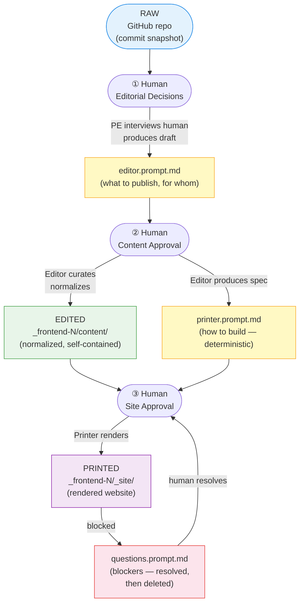

# Publishing Orchestra — Design v2

**Status**: Current design reference (March 2026). Supersedes `publishing-orchestra-1.md`.

A multi-agent system that transforms a reproducible analytics repository into a static Quarto website — with human editorial control at every stage.

---

## Three States of Analytic Content

The central model of the Publishing Orchestra is a **three-state content lifecycle**:

```
RAW  ──────────► EDITED  ──────────► PRINTED
(repo)          (content/)           (_site/)
```

### Raw

The repository at a point in time — typically identified by a commit hash. It contains everything: working drafts, experimental analyses, internal reports, data pipelines, AI configuration, developer tooling, and partially complete work. Raw content is honest but noisy. It is not shaped for any particular audience.

> Raw = the full GitHub repo. You cannot publish Raw content directly — it requires human judgment about what belongs on a website and what doesn't.

### Edited

Content that has been curated by a human (via `editor.prompt.md`) and normalized by the Publishing Editor into `_frontend-N/content/`. The Edited state is:

- **Localized**: all edited files live in `_frontend-N/content/`, never in the repo source tree
- **Self-contained**: all referenced images, figures, and media are copied alongside page files
- **Normalized**: source formats (`.md`, `.qmd`, `.html`) are converted into website-ready Quarto pages
- **Approved**: the human has reviewed and accepted the content plan before this state is produced

> Edited = curated raw materials, ready for printing, but not yet a website.

### Printed

The rendered static website in `_frontend-N/_site/`. It is the output of `quarto render` applied to the Edited state, following the deterministic specification in `printer.prompt.md`. The Printed state is:

- **Browseable**: a self-contained `_site/` folder that can be opened in a browser or deployed to any static host
- **Reproducible**: given the same Edited state and `printer.prompt.md`, the Printer always produces the same `_site/`
- **Separable**: `_site/` does not depend on files outside itself

> Printed = the public face of the analysis. This is what an audience sees.

---

## Pipeline: How Content Moves Through the Three States



**Human checkpoints** (marked ①②③) are mandatory pauses. The Orchestrator never auto-proceeds past a checkpoint.

---

## Agents

### Publishing Orchestrator

**The only agent you interact with directly.**

| | |
|---|---|
| **Invocation** | `@publishing-orchestrator` |
| **Input** | Your instructions, `_frontend-N/` workspace state |
| **Output** | Dispatches to subagents, pauses at checkpoints, routes errors |
| **Instruction files** | None (logic is in the agent definition) |

The Orchestrator detects the current pipeline state by inspecting which files exist in `_frontend-N/`:

| State | Condition | Action |
|-------|-----------|--------|
| `INIT` | Workspace empty or missing | Run Prompt Engineer |
| `PE_READY` | `editor.prompt.md` exists | Show to human → run Editor |
| `EDITOR_READY` | `editor.prompt.md` + `content/` + `printer.prompt.md` exist | Show to human → run Printer |
| `PRINTER_READY` | All above + `_site/` | Show site to human → done |
| `BLOCKED` | `questions.prompt.md` exists | Route blockers to human → resolve → re-run Printer |

**Key constraint**: never bypasses a checkpoint; never modifies contract files without human approval.

---

### Publishing PE (Prompt Engineer)

**Helps the human articulate what to publish.**

| | |
|---|---|
| **Invocation** | Via Orchestrator (Phase 2); directly with `@publishing-pe` if re-running |
| **Input** | Repository file tree scan |
| **Output** | `_frontend-N/editor.prompt.md` (human editorial intent) |
| **Instruction files** | None (discovery logic in agent definition) |

The PE scans the repository for publishable content (analysis outputs, pipeline docs, guides, project documentation) and bootstraps a default `editor.prompt.md`. It then **interviews the human** — one question at a time — to refine:

- Which sections and pages appear on the site
- The target audience and the story the site should tell
- **Content classification**: which files print verbatim vs which should be editorialized/synthesized

#### Content Classification Decision Point

A key PE interview question is:

> *For each discovered file or section, should it appear verbatim (copied as-is) or editorialized (synthesized, restructured, or summarized by the Editor)?*

| Classification | Examples | What happens |
|----------------|----------|--------------|
| **Verbatim** | `pipeline.md`, `glossary.md`, rendered `eda-2.html`, root `README.md` in Docs section | Editor copies as-is; Printer displays without modification |
| **Editorialized** | Landing page (adapted from `README.md`), project summary (synthesized from `ai/project/`), slide deck | Editor creates new content in `_frontend-N/content/`; human reviews |

**Special case — `README.md`**: The root `README.md` is consulted when drafting the landing page (it provides project context), but it is **never used verbatim as the homepage**. The homepage requires human design input because it is the audience-facing entry point. The root `README.md` may appear verbatim in a dedicated Docs section of the navbar.

**Key constraint**: validates every explicit file path exists before finalizing `editor.prompt.md`.

---

### Publishing Editor

**Performs the Raw → Edited transformation.**

| | |
|---|---|
| **Invocation** | Via Orchestrator (Phase 3); directly with `@publishing-editor` if re-running |
| **Input** | `_frontend-N/editor.prompt.md` + repository source files (read-only) |
| **Output** | `_frontend-N/content/` (normalized pages + assets) + `_frontend-N/printer.prompt.md` (build spec) |
| **Instruction files** | `publishing-content`, `publishing-analysis`, `publishing-manipulation`, `publishing-index` |

**Critical localization rule**: everything the Editor creates or modifies goes into `_frontend-N/content/` and nowhere else. The Editor **never modifies original source files** in the repository. The repository Raw state is read-only.

Workflow:
1. Parse `editor.prompt.md` — extract sections, file references, classification notes, theme
2. Resolve each file reference — validate existence, expand globs, collect missing as warnings
3. Normalize by type — apply instruction-file rules per source format
4. Assemble `_frontend-N/content/` — mirror navigation hierarchy, copy assets
5. Generate `printer.prompt.md` — deterministic spec with explicit file list, no globs
6. Report — pages assembled per section, warnings, confirmation

**Key constraint**: deterministic — same `editor.prompt.md` + same source files → same `content/` + same `printer.prompt.md`.

---

### Publishing Printer

**Performs the Edited → Printed transformation. (Renamed from "Publishing Publisher" in v2.)**

| | |
|---|---|
| **Invocation** | Via Orchestrator (Phase 4); directly with `@publishing-printer` if re-running only the build step |
| **Input** | `_frontend-N/printer.prompt.md` + `_frontend-N/content/` (read-only) |
| **Output** | `_frontend-N/_quarto.yml` + `_frontend-N/_site/` (or `questions.prompt.md` if blocked) |
| **Instruction files** | None (logic in agent definition) |

The Printer is non-editorial. It does not make content decisions, does not interact with the human, and never reads original source files — only `content/`. If it encounters something it cannot resolve mechanically, it writes `questions.prompt.md` and stops.

Workflow:
1. Parse `printer.prompt.md` — extract site name, theme, navbar, render list, assets
2. Scaffold `_quarto.yml` — explicit render list (no wildcards), navbar from spec
3. Place content files from `content/` into project structure
4. Run `quarto render` from `_frontend-N/`
5. Reconcile — verify every page in render list appears in `_site/`
6. Report — pages rendered, warnings, site entry point

**Key constraint**: `project.render` in `_quarto.yml` must list every page individually — never use wildcards. For sites requiring asset resolution outside `content/` (e.g., redirect targets, images from root `libs/`), the Printer registers `pre-render` and `post-render` R scripts in `_quarto.yml` to handle these mechanically — no manual file placement.

---

## Contract Files

Agents communicate through files inside `_frontend-N/`. No shared memory, no direct agent-to-agent calls.

```
_frontend-N/
├── editor.prompt.md       ← WHAT to publish (human intent; PE produces, human refines)
├── printer.prompt.md      ← HOW to build (Editor produces; Printer reads)
├── content/               ← EDITED state (all normalized page files + assets)
│   ├── index.qmd
│   ├── project/
│   ├── pipeline/
│   ├── analysis/
│   └── docs/
├── _quarto.yml            ← Quarto config (Printer produces)
├── _site/                 ← PRINTED state (Printer produces)
└── questions.prompt.md    ← BLOCKERS (Printer writes; Orchestrator routes; deleted after resolution)
```

### `editor.prompt.md` — The Most Important File

This is the crystallization of human editorial intent. Everything downstream follows from it mechanically. It specifies:

- **Website name and purpose** (audience, context)
- **Index page** source (with editorial notes if creation is needed)
- **Navigation sections** with source file paths and classification notes
- **Exclusions** (patterns to skip)
- **Theme**, repo URL, footer
- **Notes** — free-form editorial instructions for the Editor

### `printer.prompt.md` — The Deterministic Build Spec

Machine-readable expansion of `editor.prompt.md`. Produced by the Editor; read by the Printer. The human reviews it but does not edit it. If it is wrong, re-run the Editor.

### `content/` — The Edited State

All source files normalized and localized. The Printer reads only from here — never from the original repository. This is what makes the Printed state reproducible independently of the repository's current Raw state.

### `questions.prompt.md` — Blockers

Appears only when the Printer cannot proceed. Contains a structured list of issues with options for resolution. The Orchestrator surfaces these to the human, applies decisions, deletes the file, and re-runs the Printer.

---

## Instruction Files (Standing Rules)

These auto-apply to matching file contexts and guide the Editor during normalization.

| File | `applyTo` | Governs |
|------|-----------|---------|
| `publishing-content.instructions.md` | `_frontend-*/**` | General normalization: verbatim asset resolution algorithm; `.md`→`.qmd` promotion for executable content; redirect transit pages for standalone HTML; mandatory image co-location |
| `publishing-analysis.instructions.md` | `analysis/**` | Analysis content: prefer `.qmd` source; use `.html` for embed-specified pages; figure selection from `prints/`; exclusions |
| `publishing-manipulation.instructions.md` | `manipulation/**` | Pipeline content: `pipeline.md` as primary; include `images/`; exclude `.R`, `nonflow/` |
| `publishing-index.instructions.md` | `_frontend-*/**` | Landing page: adapt `README.md` for web audience; strip dev commands; align links with site map; homepage requires human design, not verbatim copy |

To change how the Editor normalizes a class of files, edit the relevant instruction file.

---

## Templates (Schema References)

| File | Purpose |
|------|---------|
| `editor-prompt-template.md` | Schema PE uses to draft `editor.prompt.md` — field names, required vs optional, format |
| `printer-prompt-template.md` | Schema Editor uses to draft `printer.prompt.md` — parsing rules for the Printer |
| `questions-prompt-template.md` | Schema Printer uses to write `questions.prompt.md` — issue structure, options, required action |

Templates are schema references, not editable during normal operation. To add a new field to the contract files, document it here first.

---

## Entry Points

| File | Type | How to use |
|------|------|------------|
| `publishing-orchestra-SKILL.md` | VS Code skill | Makes the system discoverable — Copilot surfaces it when you ask about publishing |
| `publishing-new.prompt.md` | Slash command `/publishing-new` | Bootstraps a new `_frontend-N/` workspace with a default `editor.prompt.md` |

---

## Workspace Structure

Each `_frontend-N/` workspace is fully independent. You can have multiple sites — different audiences, different themes, different content selections — all from the same repository.

```
caseload-forecast-demo/
├── _frontend-1/               ← Execution workspace (website 1)
│   ├── editor.prompt.md       ← Editorial intent
│   ├── printer.prompt.md      ← Build spec (auto-generated)
│   ├── content/               ← Edited state
│   ├── _quarto.yml            ← Quarto config (auto-generated)
│   └── _site/                 ← Printed website
├── _frontend-2/               ← Execution workspace (website 2, if created)
├── analysis/
│   └── frontend-1/            ← Design workspace for frontend-1
│       ├── README.md          ← Explains this folder's purpose
│       ├── initial.prompt.md  ← Annotated human editorial brief (thinking space)
│       └── frontend-1-map.md  ← Historical visual map (v1 artifact)
└── .github/
    ├── publishing-orchestra-2.md  ← This document (v2 design reference)
    └── publishing-orchestra-1.md  ← Archived v1 design reference
```

### Design Workspace vs. Execution Workspace

| | Design workspace (`analysis/frontend-N/`) | Execution workspace (`_frontend-N/`) |
|---|---|---|
| What it is | Thinking space — annotated editorial intent with revision history | Execution space — clean contract files that agents read |
| Who uses it | Human editor | Agents |
| Key file | `initial.prompt.md` (with inline `<!-- comments -->`) | `editor.prompt.md` (comments stripped) |
| Stable? | Preserved — deliberate revision history | Overwritten on each pipeline run |

`initial.prompt.md` is the annotated source of truth. When you want to update the website:
1. Edit `initial.prompt.md` with inline reasoning
2. Copy the clean version (no comments) to `_frontend-1/editor.prompt.md`
3. Invoke `@publishing-orchestrator`

---

## System File Inventory

13 files span 4 functional layers:

```
.github/
├── agents/                                    LAYER 1 — Agents (4 files)
│   ├── publishing-orchestrator.agent.md       Entry point, pipeline coordinator
│   ├── publishing-pe.agent.md                 Content discovery, intent elicitation
│   ├── publishing-editor.agent.md             Raw → Edited transformation
│   └── publishing-printer.agent.md            Edited → Printed transformation
├── instructions/                              LAYER 2 — Standing rules (4 files)
│   ├── publishing-content.instructions.md     applyTo: _frontend-*/**
│   ├── publishing-analysis.instructions.md    applyTo: analysis/**
│   ├── publishing-manipulation.instructions.md applyTo: manipulation/**
│   └── publishing-index.instructions.md       applyTo: _frontend-*/**
├── templates/                                 LAYER 3 — Schema references (3 files)
│   ├── editor-prompt-template.md
│   ├── printer-prompt-template.md
│   └── questions-prompt-template.md
└── copilot/ + prompts/                        LAYER 4 — Entry points (2 files)
    ├── copilot/publishing-orchestra-SKILL.md
    └── prompts/publishing-new.prompt.md
```

---

## Quick Reference

| Task | What to do |
|------|------------|
| Start the publishing pipeline | `@publishing-orchestrator` |
| Bootstrap a new frontend workspace | `/publishing-new` |
| Change what pages appear on the website | Edit `analysis/frontend-N/initial.prompt.md`, copy to `_frontend-N/editor.prompt.md` |
| Re-run only the Print step | `@publishing-printer` (assumes `content/` and `printer.prompt.md` are current) |
| Add a second website for a different audience | `/publishing-new` — creates `_frontend-2/` with its own independent workspace |
| Change how `.html` files are embedded | Edit `publishing-content.instructions.md` |
| Change which analysis figures are selected | Edit `publishing-analysis.instructions.md` |
| Change the landing page derivation rules | Edit `publishing-index.instructions.md` |
| Change agent interview questions | Edit `publishing-pe.agent.md` |

---

## v2 Changes from v1

| # | Change | Rationale |
|---|--------|-----------|
| 1 | "Publishing Publisher" renamed to **"Publishing Printer"** | Better semantic fit with the Raw→Edited→Printed lifecycle model |
| 2 | **Raw→Edited→Printed** lifecycle adopted as the central organizing metaphor | Provides a clear conceptual anchor that articulates what each agent does and why |
| 3 | `publisher.prompt.md` renamed to **`printer.prompt.md`** | Consistent with Printer rename |
| 4 | **Content classification** (verbatim vs editorialized) formalized as a PE interview decision | Makes explicit a critical human judgment that was previously implicit |
| 5 | **`README.md` homepage rule** clarified | Root `README.md` consulted for index drafting but never used verbatim as homepage; appears verbatim in Docs section |
| 6 | **Editor localization rule** formalized | All Editor output must go into `_frontend-N/content/` — never modifies repo source |
| 7 | **Detailed I/O specs** added for each agent | Previous design described agent behavior but not explicit inputs/outputs |
| 8 | `analysis/frontend-1/README.md` repurposed as **design workspace README** | v1 content moved to `publishing-orchestra-1.md`; the folder now has a short, generic README |
| 9 | `publishing-orchestra.md` **removed** | Duplicate of orchestra-1; orchestra-2 is now the authoritative reference |
