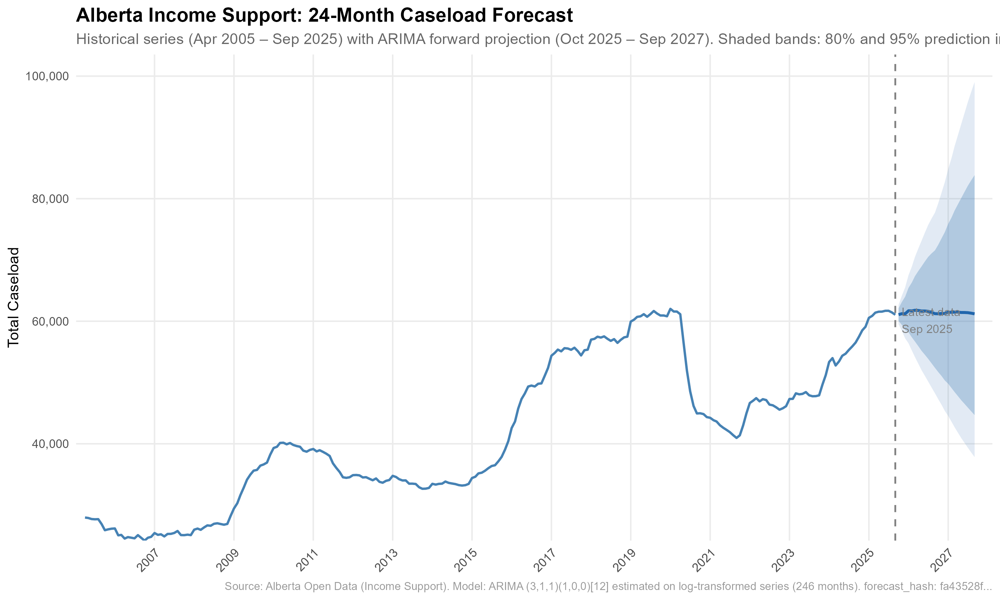

## 24-Month Forecast

{width=100% fig-alt="24-month ARIMA forecast with 80% and 95% prediction intervals for Alberta Income Support caseload."}

## Welcome

This site documents the complete arc of the Alberta Income Support caseload forecasting
project — from the open data it ingests to the 24-month projections it produces. Whether
you are here to understand the methodology, inspect the analysis, or run the pipeline
yourself, the navigation above will take you where you need to go.

- **Project** — Mission, methodology, and glossary. Start here to understand the
  analytical approach and the evidence base for modeling decisions.
- **Pipeline** — Technical reference for each pipeline stage (Ferry through Report)
  and the CACHE manifest documenting all analysis-ready datasets.
- **Analysis** — The full EDA diagnostic report and the final forecast report, both
  rendered in-browser at full resolution.
- **Docs** — The repository README, pipeline design reference, and site map.

The pipeline is fully reproducible: a single command (`Rscript flow.R`) re-runs every
stage from raw data to final HTML report.

## Pipeline Architecture

The project implements a six-stage reproducible pipeline that transforms publicly available
Alberta Income Support data into 24-month caseload projections. Each stage is a self-contained
script orchestrated by `flow.R`.


