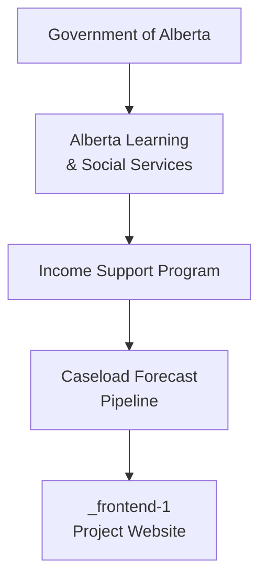
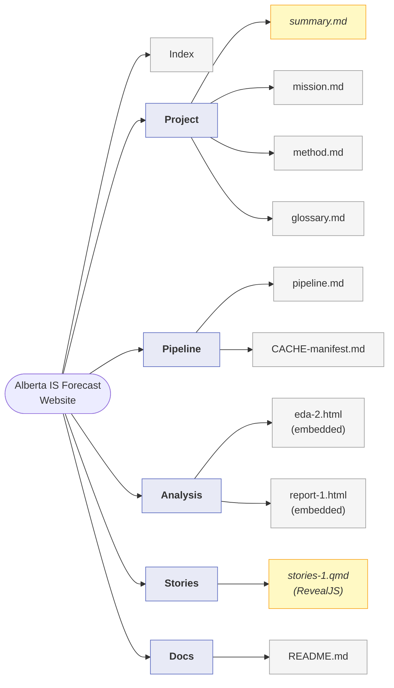
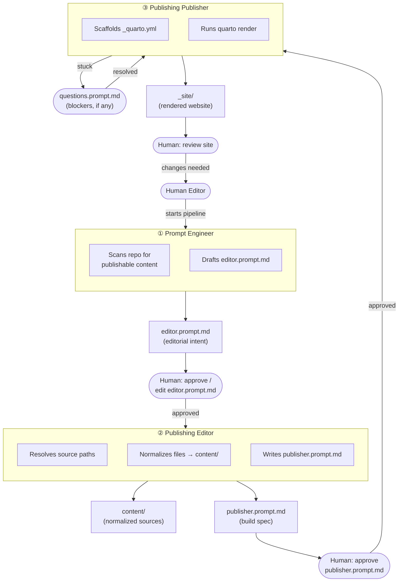

# Frontend-1 Site Map

Visual overview of the `frontend-1` website: program context, site structure, and the Publishing Orchestra pipeline that builds it.

---

## Program Context

The Alberta Income Support Caseload Forecast sits within the broader Alberta Learning and Social Services ministry hierarchy.

---

## Site Structure

Pages and source files for the `frontend-1` website, organized by navbar section.

> Note: Yellow nodes (italic) are files marked **TBD** — they must be created before the Publisher can complete the build.

---

## Publishing Orchestra Pipeline

How the four agents transform editorial intent into a rendered `_site/`.

