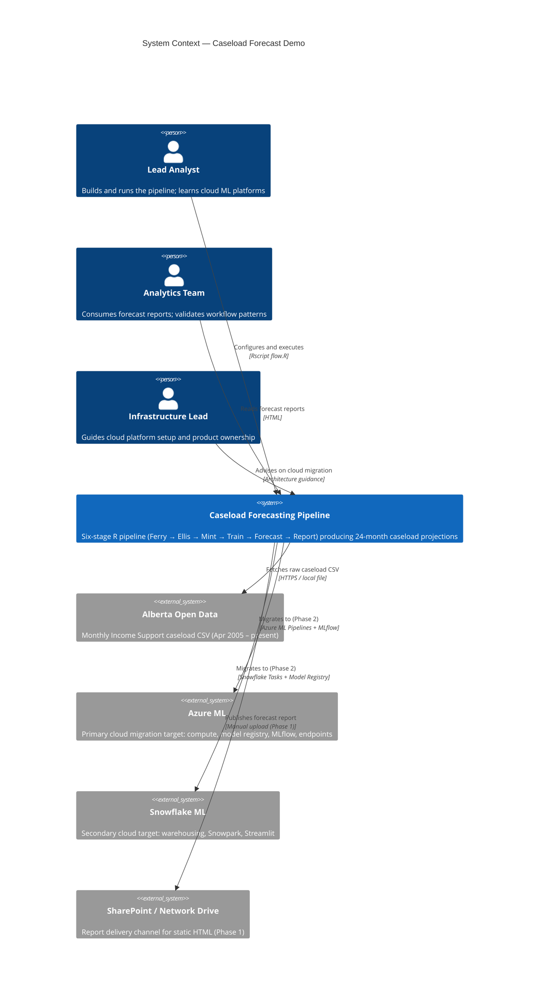
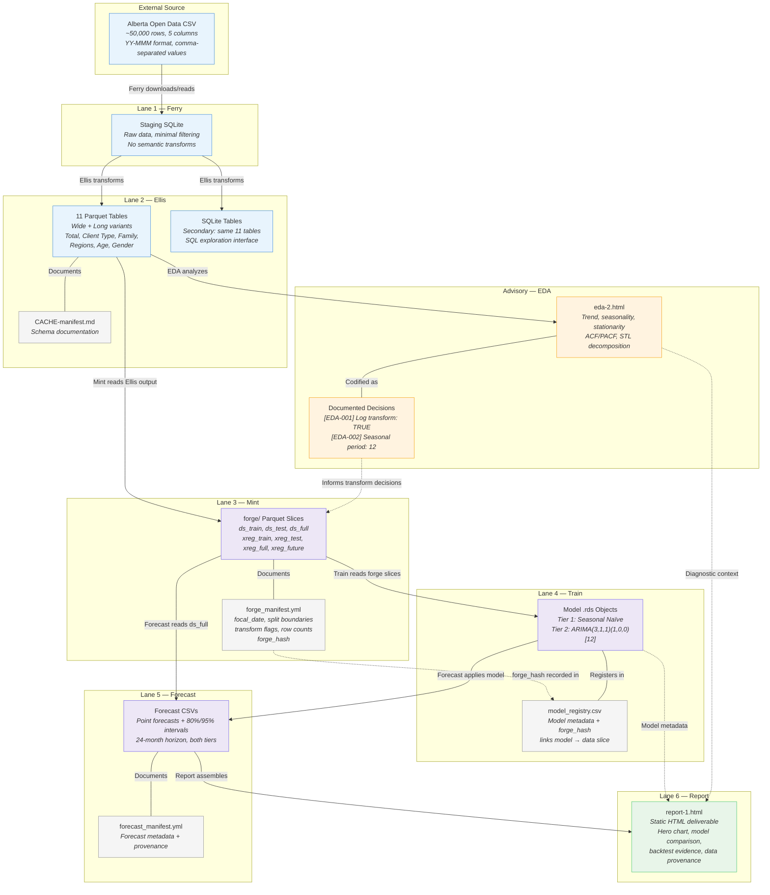

# C4 Architecture: Caseload Forecast Demo

**Purpose**: Formal architecture documentation for `andkov/caseload-forecast-demo` using the [C4 model](https://c4model.com) — selectively adopted per the assessment in [`guides/c4model-guide.md`](../../guides/c4model-guide.md).

**Last Updated**: 2026-04-18

---

## Adoption Scope

The C4 model guide recommends **selective adoption** for data analysis repositories:

| C4 Level | Adopted? | Rationale |
|:---------|:---------|:----------|
| **Level 1 — Context** | ✅ Yes | Highest-value artifact: formalizes system boundary, actors, and external systems |
| **Level 2 — Container** | ✅ Yes | Clarifies the distinct runtime units (orchestrator, scripts, data stores, reports) |
| **Level 3 — Component** | ❌ No | R scripts are procedurally organized; inline comments and method docs suffice |
| **Level 4 — Code** | ❌ No | Inappropriate for functional R codebases |
| **Data Lineage** | ✅ Yes (supplement) | Captures the artifact provenance chain that C4 cannot natively represent |

For the full assessment of C4's fit for this class of project, see [`guides/c4model-guide.md`](../../guides/c4model-guide.md).

---

## Level 1 — System Context

### What is the system and who interacts with it?

The **Caseload Forecasting System** is a reproducible R pipeline that ingests publicly available Alberta Income Support data, transforms it through six stages, and produces 24-month caseload forecasts as static HTML reports. It is the cloud-agnostic on-premises core designed for subsequent migration to Azure ML and Snowflake.



### Context Narrative

**System boundary**: The pipeline runs entirely on a local workstation. A single command (`Rscript flow.R`) executes all six stages and produces the final HTML report. No network services, APIs, or cloud resources are required for Phase 1.

**External data source**: The sole input is a publicly available CSV from [Alberta Open Data](https://open.alberta.ca/opendata/income-support-aggregated-caseload-data) containing monthly aggregates of Income Support caseload, intakes, and exits (April 2005 – September 2025, ~50,000 rows). Ferry can download this directly or read a local copy.

**Actors**:

- **Lead Analyst** — Primary user who configures `config.yml`, runs the pipeline, and interprets results. Also the person learning cloud ML platforms through this demo.
- **Analytics Team** — Secondary audience who consumes the HTML forecast reports and validates workflow patterns for reuse in other projects.
- **Infrastructure Lead** — Provides guidance on cloud infrastructure, compute provisioning, and product ownership for Phase 2 migration.

**Cloud targets** (Phase 2, not yet active): Azure ML (primary) and Snowflake ML (secondary) are planned migration destinations. Provider-specific forks (`caseload-forecast-demo-azure`, `caseload-forecast-demo-snowflake`) will adapt the pipeline for each platform.

---

## Level 2 — Container

### What are the major runtime and storage units?

```mermaid
C4Container
    title Container Diagram — Caseload Forecast Demo

    Person(analyst, "Lead Analyst", "Runs pipeline, reviews reports")

    System_Boundary(sys, "Caseload Forecasting Pipeline") {

        Container(orchestrator, "flow.R", "R Script", "Pipeline orchestrator: sequences execution of all stages via ds_rail tibble")
        Container(config, "config.yml", "YAML", "Central configuration: focal_date, forecast_horizon, paths, model settings, random seed")

        Container(ferry, "1-ferry.R", "R Script", "Ferry: imports raw CSV from 4 equivalent sources into staging database")
        Container(ellis, "2-ellis.R", "R Script", "Ellis: transforms raw data into 11 analysis-ready tables (wide + long)")
        Container(mint, "3-mint-IS.R", "R Script", "Mint: train/test split, log transform, xreg matrices → forge/ Parquet slices")
        Container(train, "4-train-IS.R", "R Script", "Train: fits Tier 1 (Seasonal Naïve) and Tier 2 (ARIMA) models")
        Container(forecast, "5-forecast-IS.R", "R Script", "Forecast: generates 24-month projections + backtest diagnostics")

        Container(eda, "eda-2.qmd", "R + Quarto", "EDA: advisory diagnostics — trend, seasonality, stationarity (outside flow.R)")
        Container(report, "report-1.qmd", "R + Quarto", "Report: assembles final HTML deliverable with forecasts and model comparison")

        ContainerDb(sqlite, "Staging SQLite", "SQLite", "Ferry output: raw data staging + Ellis secondary output")
        ContainerDb(parquet, "Parquet Data Store", "Apache Parquet", "Ellis primary output (11 tables), Mint forge slices, forecast CSVs")
        ContainerDb(models, "Model Store", "R .rds files", "Train output: fitted model objects (Seasonal Naïve, ARIMA)")

        Container(scripts, "scripts/", "R", "Shared functions: common-functions.R, graph-presets.R, modeling utilities")
    }

    System_Ext(opendata, "Alberta Open Data", "Monthly CSV")

    Rel(analyst, orchestrator, "Executes", "Rscript flow.R")
    Rel(analyst, config, "Configures", "Edits YAML")
    Rel(analyst, eda, "Runs manually", "quarto render")

    Rel(orchestrator, ferry, "Invokes (Lane 1)")
    Rel(orchestrator, ellis, "Invokes (Lane 2)")
    Rel(orchestrator, mint, "Invokes (Lane 3)")
    Rel(orchestrator, train, "Invokes (Lane 4)")
    Rel(orchestrator, forecast, "Invokes (Lane 5)")
    Rel(orchestrator, report, "Invokes (Lane 6)")

    Rel(ferry, opendata, "Downloads CSV", "HTTPS / local file")
    Rel(ferry, sqlite, "Writes staging data", "DBI + RSQLite")

    Rel(ellis, sqlite, "Reads staging, writes analysis-ready tables", "DBI + RSQLite")
    Rel(ellis, parquet, "Writes 11 analysis-ready tables", "arrow::write_parquet")

    Rel(eda, parquet, "Reads Ellis output", "arrow::read_parquet")
    Rel(eda, mint, "Informs analytical decisions", "Documented in Mint script")

    Rel(mint, parquet, "Reads Ellis output, writes forge/ slices", "arrow")
    Rel(mint, config, "Reads focal_date, split params", "config::get")

    Rel(train, parquet, "Reads Mint forge slices", "arrow::read_parquet")
    Rel(train, models, "Writes fitted model .rds", "saveRDS")

    Rel(forecast, models, "Reads fitted models", "readRDS")
    Rel(forecast, parquet, "Reads Mint ds_full, writes forecast CSVs", "arrow")

    Rel(report, parquet, "Reads forecast output", "arrow::read_parquet")
    Rel(report, models, "Reads model metadata", "readRDS")

    Rel(ferry, scripts, "Sources shared functions")
    Rel(ellis, scripts, "Sources shared functions")
    Rel(mint, scripts, "Sources shared functions")
    Rel(train, scripts, "Sources shared functions")
    Rel(forecast, scripts, "Sources shared functions")
```



### Container Narrative

**Adaptation from standard C4**: In a conventional C4 Container diagram, containers communicate via network protocols (HTTP, REST, messaging). In this pipeline, containers communicate via the **file system** — scripts read and write Parquet files, SQLite databases, and `.rds` model objects. Arrows are labeled with I/O operations (`arrow::read_parquet`, `saveRDS`) rather than API calls. This is non-standard for C4 but accurately represents data pipeline architecture.

**Orchestrator** (`flow.R`): The single entry point. Defines a `ds_rail` tibble listing every script and its execution function (`run_r`, `run_qmd`). Scripts are invoked sequentially — no parallelism, no conditional branching. All pipeline parameters are externalized to `config.yml`.

**Pipeline scripts** (`manipulation/`): Five R scripts implementing the Ferry → Ellis → Mint → Train → Forecast pattern. Each script is self-contained: it loads packages, reads its inputs, performs its stage, and writes its outputs. Scripts never reach back to a prior stage's inputs — Mint reads Ellis output, Train reads Mint output, etc.

**Advisory report** (`eda-2.qmd`): Runs outside the pipeline as an analytical diagnostic. Its findings (log transform decision, seasonal period, ARIMA order candidates) are codified in Mint and Train scripts. The dashed arrow from EDA to Mint represents a *documented decision*, not a data dependency.

**Delivery report** (`report-1.qmd`): Lane 6 of the pipeline. Assembles forecast charts, model comparison tables, backtest evidence, and narrative into a static HTML report.

**Data stores**:

| Store | Format | Written by | Read by | Location |
|:------|:-------|:-----------|:--------|:---------|
| Staging SQLite | SQLite | Ferry, Ellis | Ellis | `data-private/derived/open-data-is-2.sqlite` |
| Parquet data store | Apache Parquet | Ellis, Mint, Forecast | Mint, Train, Forecast, EDA, Report | `data-private/derived/` |
| Model store | R `.rds` | Train | Forecast, Report | `data-private/derived/models/` |

**Shared functions** (`scripts/`): Common utilities sourced by multiple pipeline scripts — graphing presets (`graph-presets.R`), base plotting theme (`common-functions.R`), and modeling helpers (`scripts/modeling/`).

**Configuration** (`config.yml`): Central YAML file storing `focal_date`, `forecast_horizon`, `backtest_months`, `use_log_transform`, `random_seed`, directory paths, and database connection info. Changing `focal_date` invalidates all Mint/Train/Forecast artifacts.

---

## Supplementary — Data Lineage

### How do artifacts flow through the pipeline?

C4 diagrams show structural containment and dependencies but cannot natively represent **data lineage** — which script produced which artifact, how data shape changes across stages, and how versioning bonds link artifacts together. This supplementary diagram fills that gap.



### Lineage Narrative

**Artifact types**: The pipeline produces three categories of artifacts:

| Category | Examples | Format | Purpose |
|:---------|:---------|:-------|:--------|
| **Data artifacts** | Ellis tables, forge slices, forecast CSVs | Apache Parquet | Analytical inputs/outputs — the primary work products |
| **Model artifacts** | Fitted Seasonal Naïve, ARIMA objects | R `.rds` | Trained model objects (R-native; cannot be stored as Parquet) |
| **Metadata artifacts** | `CACHE-manifest.md`, `forge_manifest.yml`, `model_registry.csv`, `forecast_manifest.yml` | Markdown, YAML, CSV | Provenance documentation and versioning bonds |

**Versioning chain** (Mint → Train → Forecast):

```
focal_date (config.yml)
    │
    ▼
forge_manifest.yml ── forge_hash ──► model_registry.csv ──► forecast_manifest.yml
    │                                     │                        │
    ▼                                     ▼                        ▼
forge/*.parquet                    models/*.rds              forecast/*.csv
```

Changing `focal_date` in `config.yml` invalidates **all** Mint, Train, and Forecast artifacts. The `forge_hash` is the versioning bond that traces every model and forecast back to the exact data slice that produced it. This is the minimum viable lineage for Phase 1; Phase 2 transitions to a cloud model registry with MLflow tracking.

**Schema evolution across stages**:

| Stage | Input Shape | Output Shape | Key Transform |
|:------|:-----------|:------------|:--------------|
| Ferry | Raw CSV (~50,000 rows, 5 cols, `YY-MMM` dates, comma-formatted values) | SQLite staging table (same structure, minimal filtering) | Format transport only |
| Ellis | Staging table | 11 tables: 6 dimensions × wide/long (246–990 rows each) | Date parsing, numeric cleaning, factor enrichment, dimensional splitting |
| Mint | Ellis total caseload table (246 rows) | `ds_train` (222 rows), `ds_test` (24 rows), `ds_full` (246 rows) + xreg matrices | Train/test split at `focal_date - 24mo`, log transform, `ts` object construction |
| Train | Mint forge slices | 2 fitted model `.rds` objects + registry entry | Model estimation on training slice, backtest on test slice |
| Forecast | Mint `ds_full` + Train models | CSV with point forecasts + 80%/95% intervals for 24 months | Forward projection from `focal_date` |

---

## Cross-References

This document is part of the project's architecture documentation suite:

| Document | Location | Relationship to C4 |
|:---------|:---------|:--------------------|
| **Pipeline Execution Guide** | [`manipulation/pipeline.md`](../../manipulation/pipeline.md) | Detailed stage-by-stage technical reference (complements Container diagram) |
| **CACHE Manifest** | [`data-public/metadata/CACHE-manifest.md`](CACHE-manifest.md) | Ellis output schemas (data artifact detail that C4 cannot represent) |
| **INPUT Manifest** | [`data-public/metadata/INPUT-manifest.md`](INPUT-manifest.md) | Raw source data documentation (external system detail) |
| **Project Mission** | [`ai/project/mission.md`](../../ai/project/mission.md) | Stakeholder list and project objectives (Context diagram source) |
| **Project Method** | [`ai/project/method.md`](../../ai/project/method.md) | Pipeline methodology and stage contracts (Container diagram source) |
| **C4 Model Guide** | [`guides/c4model-guide.md`](../../guides/c4model-guide.md) | Assessment of C4's fit for this project class |

---

*Diagrams use [Mermaid C4 syntax](https://mermaid.js.org/syntax/c4.html), renderable natively by GitHub, Quarto, and VS Code.*
